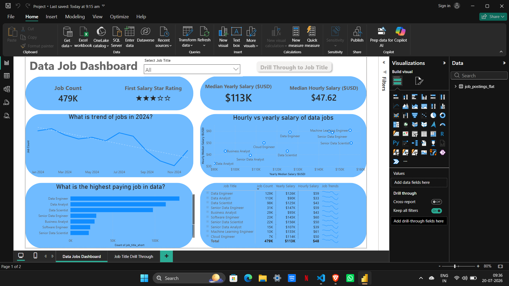
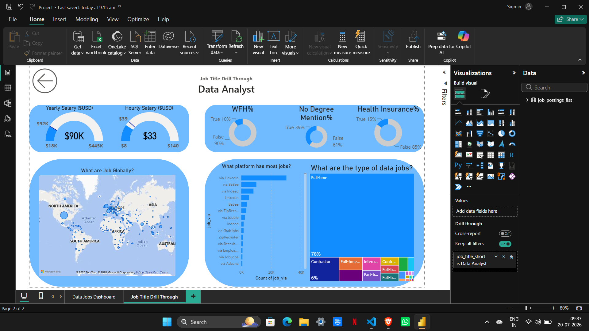

# 📊 Data Jobs Dashboard | Power BI

 


[View interactive dashboard here on the Power BI Service](https://Maheshwar026/PowerBIProject)


## 📌 Project Overview

The **Data Jobs Dashboard** is an interactive Power BI project that analyzes job market trends in the data industry. It provides insights into job availability, salaries, job locations, hiring platforms, remote work opportunities, and employment types.

The dashboard enables recruiters, job seekers, and analysts to make informed decisions through interactive visualizations and drill-through reports.

---

# 📂 Project Structure

```
Power BI Project/
│── Power BI Dashboard.pbix
│── README.md
│── images/
│     ├── dashboard1.png
│     └── dashboard2.png
```

---

# 🚀 Features

- Interactive Dashboard
- Drill Through Report
- Dynamic Filters & Slicers
- KPI Cards
- Salary Analysis
- Job Trend Analysis
- Global Job Distribution
- Platform-wise Job Analysis
- Employment Type Analysis

---

# 📊 Dashboard Reports

## 1️⃣ Main Dashboard

The main dashboard provides an overview of the data job market.

### Key Metrics

- 📌 Total Job Count
- ⭐ Average Company Rating
- 💰 Median Yearly Salary
- ⏰ Median Hourly Salary

### Visualizations

- Job Trends (2024)
- Hourly vs Yearly Salary Analysis
- Highest Paying Data Jobs
- Job Summary Table
- Job Title Filter
- Drill Through Navigation

### Dashboard Preview

<p align="center">

</p>

---

## 2️⃣ Job Title Drill Through Report

Selecting a job title from the main dashboard opens a detailed report for that specific role.

### Insights

- 💰 Yearly Salary
- ⏰ Hourly Salary
- 🌍 Global Job Locations
- 🏠 Work From Home Percentage
- 🎓 No Degree Requirement
- 🏥 Health Insurance Availability
- 📢 Hiring Platforms
- 💼 Employment Types

### Dashboard Preview

<p align="center">

</p>

---

# 📈 KPIs

- Total Jobs Available
- Median Salary
- Median Hourly Pay
- Company Rating
- Remote Work %
- Health Insurance %
- Degree Requirement %
- Hiring Platform Distribution

---

# 🛠️ Tools Used

- Power BI Desktop
- Power Query
- DAX
- Data Modeling
- Data Visualization

---

# 🎯 Business Insights

- Identify the highest-paying data jobs.
- Analyze salary trends across different job roles.
- Understand global hiring patterns.
- Compare hourly and yearly salaries.
- Discover the most popular hiring platforms.
- Evaluate remote work opportunities.
- Explore employment types across the industry.

---

# ⚙️ How to Use

1. Download the repository.
2. Open **Data Jobs Dashboard.pbix** using Power BI Desktop.
3. Refresh the dataset if needed.
4. Use filters and slicers to interact with the dashboard.
5. Click a job title to view the detailed Drill Through report.

---

# 📸 Screenshots

## Main Dashboard


---

## Drill Through Dashboard


---

# 📌 Future Improvements

- Live Data Integration
- Real-Time Dashboard Refresh
- AI-Based Salary Prediction
- Industry-wise Analysis
- Experience-wise Salary Insights
- Skills Demand Dashboard

---

# 👨‍💻 Author

**Maheshwar varma Pokala**

📧 Email: maheshwarvarma2004@gmail.com

🔗 GitHub: https://github.com/Maheshwar026

🔗 LinkedIn: https://linkedin.com/in/maheshwarvarma

---

## ⭐ If you found this project useful, consider giving it a Star on GitHub!